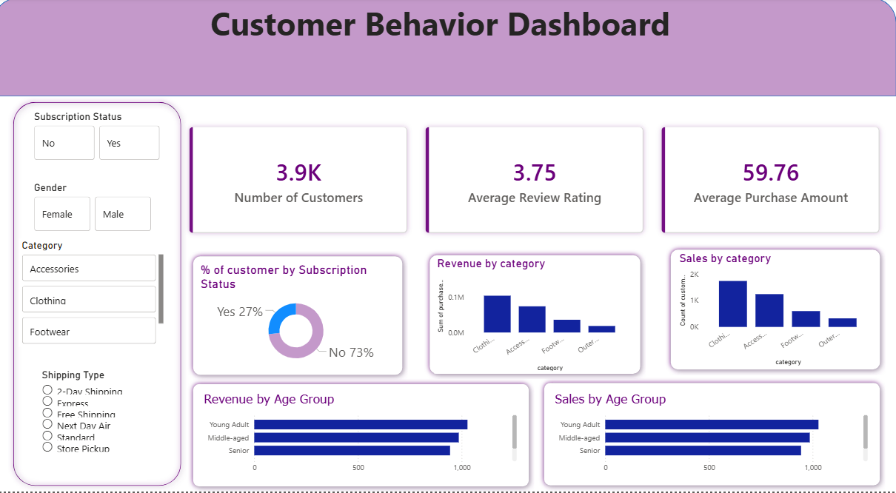

# Customer Behavior Analysis

## Overview

This project analyzes customer shopping behavior using SQL, Python, and Power BI to uncover purchasing patterns, customer preferences, and business insights.

The project demonstrates a complete analytics workflow, including data cleaning, exploratory analysis, data transformation, and interactive dashboard development.

## Business Objectives

* Analyze customer purchasing behavior.
* Identify spending patterns across customer segments.
* Explore product category performance.
* Examine the impact of discounts and subscription status.
* Build an interactive dashboard to support business decision-making.

## Tools & Technologies

* SQL
* Python
* Pandas
* Jupyter Notebook
* Power BI
* Git & GitHub

## Dataset

The dataset contains customer shopping transactions, including demographic information, purchase details, payment methods, product categories, and customer preferences.

Key attributes include:

* Customer ID
* Age
* Gender
* Category
* Item Purchased
* Purchase Amount
* Location
* Season
* Payment Method
* Subscription Status
* Shipping Type
* Review Rating
* Previous Purchases
* Frequency of Purchases

## Project Workflow

### 1. Data Cleaning

* Checked data quality.
* Handled missing values.
* Standardized column names.
* Corrected data types.
* Prepared the dataset for analysis.

### 2. Data Analysis

Performed exploratory data analysis to identify:

* Customer demographics
* Spending behavior
* Product preferences
* Seasonal purchasing trends
* Subscription patterns

### 3. Dashboard Development

Created an interactive Power BI dashboard to visualize:

* Sales Performance
* Customer Demographics
* Product Categories
* Purchase Trends
* Customer Behavior
* Business KPIs

## Dashboard Preview



## Repository Structure

```text
Customer-Behavior-Analysis/
│
├── dashboards/
│    └── Customer Behavior.pbix
├── data/
│    └── customer_shopping_behavior.csv.xlsx
├── images/
│   └── dashboard.png
│
├── notebook/
│   └── Customer_shopping_behavier.ipynb
├── sql/
│   └── customer_behavior.sql
└── README.md
```

## Skills Demonstrated

* SQL Querying
* Data Cleaning
* Data Transformation
* Exploratory Data Analysis
* Data Visualization
* Dashboard Design
* Business Intelligence
* Git Version Control

## Author

Omnia Taha Awad

Software Engineering Graduate transitioning into Data Analytics with practical experience in SQL, Python, Power BI, and business data analysis.
